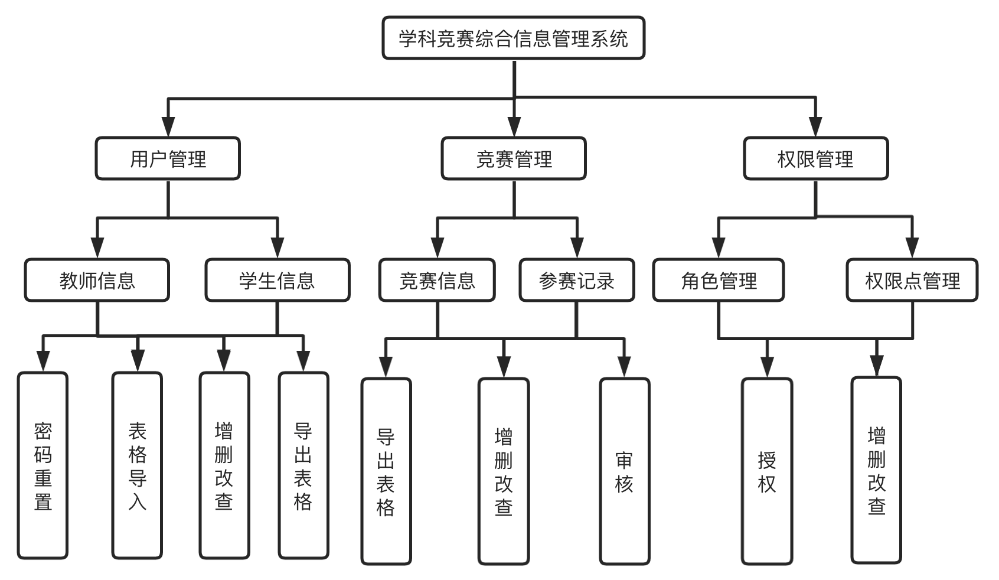

# 项目简介

系统主要以小而美的方式进行实现，专注于用户体验和功能需求的完善。主要设计并实现了以下功能：

1. 竞赛信息管理功能，具有相应权限的用户可以向系统中添加竞赛信息；
2. 成绩录入功能，具有相应权限的用户可以查看或修改参赛记录信息，可修改录入系统中的成绩信息。
3. 用户管理功能：主要包括对学生和教师信息的管理。
4. 权限管理：包括对系统权限和系统角色的管理，以角色授权等操作，采用 RBAC(Role Based Access Control)策略，基于角色进行细致的权限控制。

其中竞赛信息，参赛信息和用户信息支持导出 Excel，且用户信息支持 Excel 导入，方便管理员管理系统信息。

系统主要工作在 RBAC 权限管理上，算是一个小小的亮点，其他诸如用户管理、竞赛管理均是简单的增删改查。虽有不完善的地方，但很适合作为一个起始项目，由你们添砖加瓦，作为毕设或者大作业等。

在技术选型上以 JavaScript & Node.js 为主要开发语言，前端使用 Vue.js 全家桶，后端主要使用 Node.js 与 TypeScript 实现，采用 Web 服务框架 Express 与 MySQL 数据库构建后台应用。

[后端项目地址](https://github.com/1446445040/competition-server)

**用都用了，点个星星呗**。

# 项目运行

请预先安装 Node.js 环境，并在项目根目录下运行以下命令：

```shell
npm install --registry https://registry.npm.taobao.org/ # 使用淘宝镜像源安装依赖包
npm run serve # 启动项目
```

启动项目进入首页，系统初始账号密码为`admin/123`，身份为学生。

> 如果改变后端地址(localhost:3000)，请修改`vue.config.js`中对应的代理配置。

为了良好的开发体验，vscode 建议安装 eslint 插件并打开保存时自动运行 eslint 选项，具体可以百度

# 功能模块图



# 系统截图

## 登录界面


## 赛事列表


## 参赛记录


## 学生列表


## 教师列表


## 用户导入


## 授权


## 角色列表


## 角色编辑


## 权限列表


## 编辑权限


